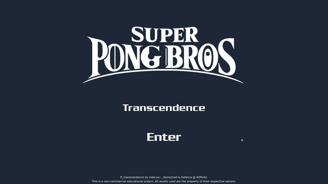
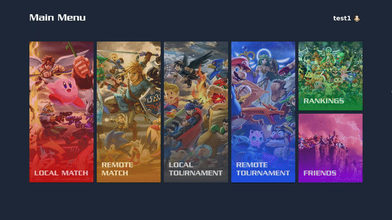
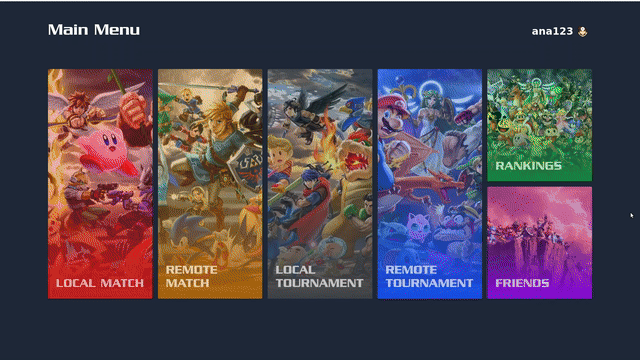
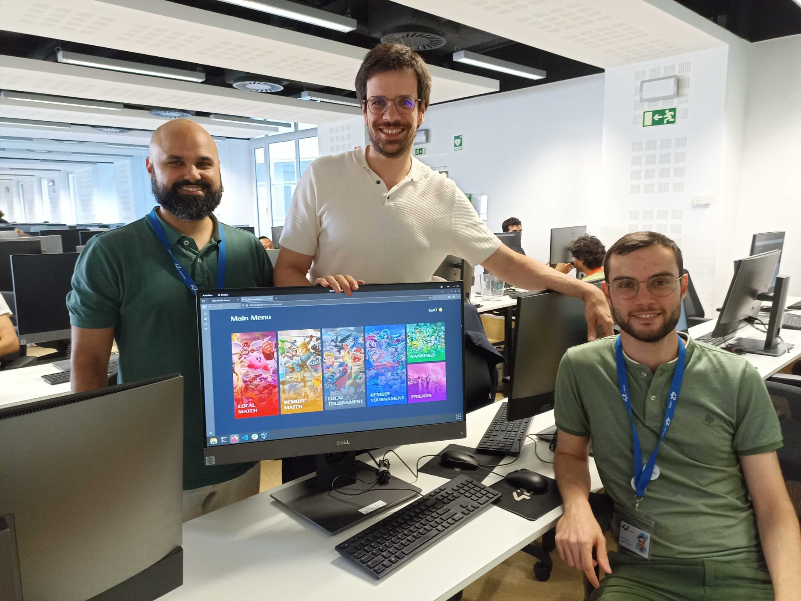

<h1> ✨ 42Porto-Transcendence ✨ </h1>
Transcend Your Gaming Limits with the Ultimate Pong Experience!

<i>This project is about doing something you’ve never done before. Remind yourself of the beginning of your journey in computer science. Look at you now. Time to shine!</i>

Dive deep into our development process! Check out our dev notes, ideas, and the rationale behind our decisions on our project's <a href="https://github.com/miguelsrmv/42Porto-Transcendence/wiki"><b>🚀 Git Wiki</b></a>!

<strong>Legal Disclaimer</strong>

This project is a non-commercial fan-made project and is not affiliated with or endorsed by Nintendo. All trademarks, logos, and copyrighted materials are the property of their respective owners. No copyrighted assets are distributed with this project. The assets shown below are here merely for demonstration purposes.

<h2> 🚀 About The Project </h2>

Transcendence is our take on the legendary arcade game, Pong, reimagined for the modern web. This isn't just a game; it's a full-fledged web application featuring real-time multiplayer action, social features, and intense tournaments. Built from the ground up, this project showcases our passion for clean code, robust architecture, and creating fun, interactive experiences.

Ready to see it in action?

<h2> 🌟 Features Showcase </h2>

Explore the core features of Transcendence through these short clips.

<b>🚪 A Grand Welcome: The Landing Page</b>

 

Our landing page is designed to be your portal into the world of Transcendence. Log in (with optional 2FA) and get ready to play.

  

 

<b>🕹️ Couch Co-op: Classic Local Game</b>

 

Challenge a friend on the same keyboard in a classic, no-frills game of Pong. It's fast, frantic, and a true test of reflexes and friendships!

  

 

<b>🌠Global Domination: Remote Multiplayer Match</b>

 

Find an opponent from anywhere in the world. Experience seamless, real-time gameplay and prove you're the best.

  

 

<b>🆠The Gauntlet: Intense Local and Remote Tournaments</b>

 

Gather your friends and crown a champion! Our tournament mode handles all the brackets and matchups for you. All you have to do is win.

  

 

<b>🤯 Crazy Pong: A new take on a classic game</b>

 

Think you've mastered Pong? Think again! Our exclusive Crazy Pong mode introduces unique characters, each wielding a game-changing superpower. Choose your champion, time your ability perfectly, and unleash chaos on the arena!

#### Meet the Champions:

| Character | Superpower | Description |
| :---: | :---: | :--- |
| 🍄 **Mario** | `Super Shroom` | Ingest a Super Shroom to instantly grow your paddle, creating an almost impenetrable defensive wall. |
| 🥚 **Yoshi** | `Egg Barrage` | Unleash a chaotic flurry of decoy eggs onto the field, overwhelming your opponent's senses and hiding the real ball in the mayhem. |
| ⏩ **Sonic** | `Spin Dash` | Channel the blue blur's iconic move to launch the ball at blistering, near-supersonic speed. Gotta go fast! |
| ⚡️ **Pikachu** | `Thunder Wave` | Zap your opponent's paddle with a jolt of electricity, stunning it and drastically slowing its movement for a short time. |
| 🧠 **Mewtwo** | `Confusion` | Unleash potent psychic power to temporarily invert your opponent's controls, forcing them to fight their own instincts. |
| 🪃 **Link** | `Gale Boomerang` | Hurl a magic boomerang that catches the ball mid-flight, suddenly reversing its vertical direction to catch your opponent off-guard. |
| 🌟 **Kirby** | `Inhale` | Do what Kirby does best! Inhale and copy the last superpower used by your opponent, turning their own strategy against them. |
| 👊 **Donkey Kong** | `Giant Punch` | Wind up and deliver a devastating blow that smashes your opponent's paddle, temporarily shrinking it to a pathetic size. |
| 🔮 **Samus** | `Morph Ball` | Encapsulate the ball in Morph Ball energy, drastically slowing its momentum and giving you time to line up the perfect shot. |
| 🔥 **Cpt. Falcon** | `Falcon Boost` | "Show me ya moves!" Engage your paddle's boosters for a burst of incredible speed, perfect for making those impossible, clutch saves. |
| 🐢 **Bowser** | `Shell Retreat` | The ball retreats into Bowser's spiky shell, rendering it completely invisible until the moment it's about to strike your opponent. |
| 📦 **Snake** | `Stealth Camo` | Activate active camouflage on your opponent's paddle, making it completely invisible. They can't hit what they can't see. |

<b>📈 Climb the Ladder: Rankings & Leaderboards</b>

 

Track your stats, view your match history, and see how you stack up against other players on the global leaderboard. The top spot is waiting!

  

 

<b>👥 Better Together: Friends & Social</b>

 

Add friends to see who's online. The social hub keeps you connected to your rivals and teammates.

  

 

<b>⚙️ Make It Yours: Profile & Settings</b>

 

Customize your public profile, change your display name, upload a new avatar, and enable Two-Factor Authentication (2FA) for enhanced security.

  

 

---

## 🤝 Meet The Team

| Name                | Role         | GitHub Profile                               |
| ------------------- | ------------ | -------------------------------------------- |
| **Miguel Sá**       | Frontend     | [miguelsrmv](https://github.com/miguelsrmv)  |
| **David Machado**   | Backend      | [damachad](https://github.com/damachad)  |
| **Tiago Martins**   | Blockchain   | [TiagoMartins14](https://github.com/TiagoMartins14)  |

 

  

---

### Acknowledgements

*   A huge thank you to **[42 Porto](https://www.42porto.com/pt/)** for providing the opportunity and framework for this incredible project.
*   To all the staff and peers who supported us along the way.

<i>Made with ❤️ by 42 Porto students.</i>

